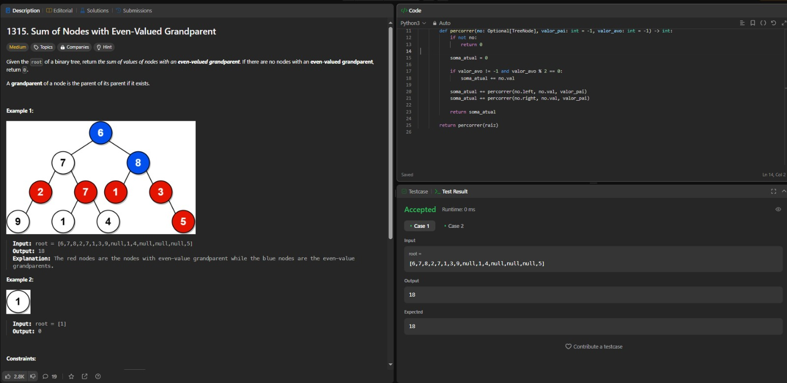
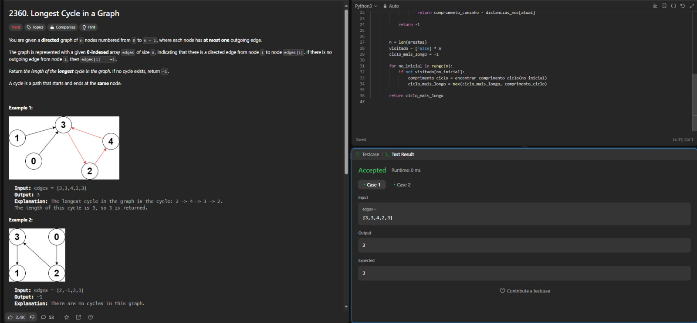
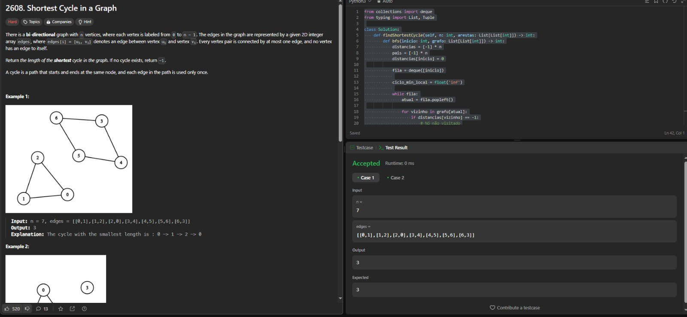

# 1337

**Número da Lista**: 1 
**Conteúdo da Disciplina**: Grafos1 

## Alunos
|Matrícula | Aluno |
| -- | -- |
| 221031238  |  Victor Augusto de Sousa Câmara|
| 190048191  |  Renan Rodrigues Lacerda |

## Sobre 
Este projeto é dedicado à resolução de três problemas de grafos que abordam diferentes aspectos da estrutura e propriedades dos grafos. Cada problema possui características únicas e exige a aplicação de diferentes técnicas e algoritmos para sua resolução. Os problemas abordados são:

**Sum of Nodes with Even-Valued Grandparent:** Neste problema, dado um grafo representado como uma árvore, o objetivo é calcular a soma dos valores dos nós que possuem um "avô" (ou nó a dois níveis acima) de valor par. A solução requer a navegação cuidadosa pela estrutura hierárquica da árvore e a implementação de verificações condicionais para atender aos requisitos de parentesco e valor do nó.

**Shortest Cycle in a Graph:** Aqui, a tarefa é encontrar o menor ciclo presente no grafo. Este problema é frequentemente abordado em grafos não direcionados e exige o uso de algoritmos de busca, como o BFS (Busca em Largura), para identificar o ciclo com a menor quantidade de arestas. A dificuldade principal está em lidar com a presença de múltiplos caminhos e garantir que o ciclo identificado seja o mais curto.

**Longest Cycle in a Graph**: Diferente do ciclo mais curto, este problema busca o ciclo de maior comprimento dentro de um grafo direcionado. Como os ciclos mais longos não são fáceis de identificar devido à complexidade crescente com o tamanho do grafo, a resolução deste problema envolve técnicas de busca que podem incluir DFS (Busca em Profundidade) combinada com a detecção de ciclos.

## Screenshots

[1315. Sum of Nodes with Even-Valued Grandparent1315](https://leetcode.com/problems/sum-of-nodes-with-even-valued-grandparent/description/)
  

[2360. Longest Cycle in a Graph](https://leetcode.com/problems/longest-cycle-in-a-graph/description/)
  

[2608. Shortest Cycle in a Graph](https://leetcode.com/problems/shortest-cycle-in-a-graph/description/)

## Instalação 
**Linguagem**: Python 

